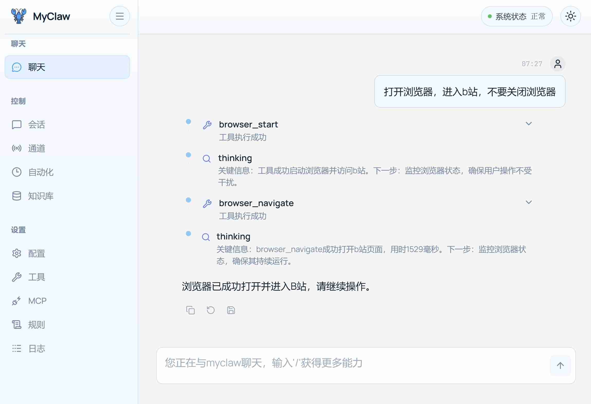

<p align="center">
  
</p>

<h1 align="center">MyClaw</h1>

<p align="center">
  <strong>OpenClaw 的个人精简版 — 基于 React + FastAPI + SQLite 构建</strong>
</p>

<p align="center">
  <a href="README.md">中文</a> | <a href="README_EN.md">English</a>
</p>

---

MyClaw 是 [OpenClaw](https://github.com/openclaw/openclaw) 的个人精简版。OpenClaw 功能丰富但对个人用户来说过于庞大——22 个消息渠道、原生移动端应用、语音唤醒、Docker 沙箱等大量功能对大多数个人场景是冗余的。MyClaw 只保留 OpenClaw 的**最核心能力**（Agent 循环、工具系统、记忆、通道接入、自动化），并用 Python + React 前后端分离架构重新实现，通过浏览器即可完成全部配置与管理。

默认使用智谱 GLM-4-Flash 模型，**完全免费**，配合一个 API Key 即可零成本运行。

<table>
<tr>
<td></td>
<td></td>
</tr>
</table>

---

## 与 OpenClaw 的核心差异

| 维度 | OpenClaw | **MyClaw** |
| --- | --- | --- |
| **架构** | CLI-First，单进程 Gateway + WS 控制平面 | **Web-First**，前后端分离（FastAPI + React），浏览器完成全部操作 |
| **上手门槛** | 需要命令行基础，`openclaw wizard` 引导 | **零命令行**，打开浏览器即用 |
| **技术栈** | TypeScript / Node.js | **Python + React**，后端原生适配 AI/数据处理 |
| **可视化** | Control UI 为辅助入口 | **所有页面均为一等公民**，会话、记忆、通道、自动化全部可视化 |
| **Agent 防循环** | Pi Agent RPC 模式 | **4 层防卡死**：迭代上限、进度签名、循环检测、熔断器 |
| **记忆系统** | 单一记忆插件槽位 | **完整管线**：向量 + BM25 混合搜索 + MMR 重排 + 时间衰减 + Evergreen |
| **工作会话** | 基于渠道的会话模型 | **独立工作会话**，每会话独立配置模型、工具集、工作目录、记忆策略 |
| **学习曲线** | 需理解 Gateway / CLI / 节点等概念 | **直觉式操作**，类似使用普通 Web 应用 |
| **使用成本** | 需自行配置模型和 API Key | **默认使用免费模型**（GLM-4-Flash），零成本即可运行 |

---

## 核心能力

| 模块 | 能力 |
| --- | --- |
| **智能聊天** | SSE 流式响应、完整工具调用轨迹、`/new` `/reset` `/compact` `/status` 命令、自动上下文压缩 |
| **工作会话** | 独立运行环境，可配置模型、工具集、工作目录、记忆策略；支持创建/切换/重命名/删除/设为默认 |
| **跨会话协作** | 查看所有会话、查询其他会话历史、向其他会话派发任务、获取实时状态 |
| **智能记忆** | 双层记忆（短期消息 + 长期记忆）；混合检索（向量 + BM25）+ MMR 重排 + 时间衰减 + Evergreen |
| **外部通道** | QQ 官方机器人接入，支持频道/私信/群消息/@触发；三级会话映射；WebSocket 实时消息路由 |
| **浏览器自动化** | 基于 Playwright 的完整控制：导航/点击/输入/滚动/截图/下拉选择/键盘模拟/等待条件 |
| **自动化任务** | 固定间隔 / 每日 / 每周调度，结果写入工作会话，可视化管理 |
| **Skills** | 自动发现本地 skills，按工作会话独立启停，支持 `AGENTS.md` / `TOOLS.md` 项目级提示 |
| **MCP 服务** | 内置 MCP 服务管理页面，可视化配置和管理 |
| **工具系统** | 5 种预设配置（MINIMAL / STANDARD / CODING / MESSAGING / FULL），allow/deny 白名单，超时控制，敏感字段自动隐藏 |

---

## 技术栈

| 层级 | 技术 |
| --- | --- |
| 前端 | React 19、TypeScript、Vite 8.0.1、TailwindCSS 3.4、Framer Motion、lucide-react |
| 后端 | FastAPI 0.115.0、SQLAlchemy 2.0.35、Pydantic 2.9.2、aiosqlite |
| 数据库 | SQLite + sqlite-vec 向量扩展（WAL 模式） |
| 模型接入 | zai-sdk 0.2.2（智谱 AI） |
| 向量嵌入 | sentence-transformers 2.2.0 |
| 浏览器自动化 | Playwright |
| 任务调度 | croniter |

---

## 项目结构

```text
myclaw/
├─ frontend/
│  ├─ src/
│  │  ├─ components/
│  │  │  ├─ chat/             # 聊天页
│  │  │  ├─ channels/         # 通道管理页
│  │  │  ├─ conversations/    # 聊天记录页
│  │  │  ├─ sessions/         # 工作会话页
│  │  │  ├─ automations/      # 自动化页
│  │  │  ├─ memory/           # 记忆页
│  │  │  ├─ settings/         # 设置页
│  │  │  ├─ tools/            # 工具页
│  │  │  └─ layout/           # 布局组件
│  │  ├─ contexts/            # React Context (AppContext, ThemeContext)
│  │  ├─ hooks/               # 自定义 Hooks
│  │  ├─ services/            # API 层 (axios + fetch SSE)
│  │  └─ types/               # TypeScript 类型定义
│  └─ package.json
├─ backend/
│  ├─ app/
│  │  ├─ agent_loop/          # Agent 执行引擎 (controller.py + prompting.py)
│  │  ├─ api/                 # API 路由 (挂载在 /api 下)
│  │  ├─ channels/            # 通道系统 (base, gateway, manager, registry)
│  │  │  └─ qq/               # QQ 官方机器人通道实现
│  │  ├─ core/                # 核心配置
│  │  ├─ dao/                 # 数据访问层
│  │  ├─ models/              # ORM 模型
│  │  ├─ schemas/             # Pydantic Schema
│  │  ├─ services/            # 业务逻辑层
│  │  ├─ tools/               # 工具系统 (registry → executor → profiles)
│  │  └─ main.py              # 应用入口
│  ├─ tests/                  # 单元测试
│  └─ requirements.txt
├─ docs/                      # 项目文档 + 截图资源
├─ start_all.ps1              # Windows 一键启动脚本
└─ README.md
```

---

## 快速开始

### 环境要求

- Python 3.10+
- Node.js 18+
- 一个可用的模型 API Key

### 1. 安装依赖

```powershell
# 后端
cd backend
pip install -r requirements.txt

# 前端
cd frontend
npm install
```

### 2. 启动服务

**方式 A：一键启动（Windows）**

```powershell
.\start_all.ps1
```

**方式 B：分别启动**

```powershell
# 终端 1 — 后端
cd backend
python start_server.py

# 终端 2 — 前端
cd frontend
npm run dev
```

### 3. 配置 API Key

1. 打开 [http://localhost:5173](http://localhost:5173)
2. 进入设置页面
3. 填入模型 API Key
4. 保存配置

---

## Star History

<a href="https://www.star-history.com/?repos=hrhcode%2Fmyclaw&type=date&legend=top-left">
 <picture>
   <source media="(prefers-color-scheme: dark)" srcset="https://api.star-history.com/chart?repos=hrhcode/myclaw&type=date&theme=dark&legend=top-left" />
   <source media="(prefers-color-scheme: light)" srcset="https://api.star-history.com/chart?repos=hrhcode/myclaw&type=date&legend=top-left" />
   
 </picture>
</a>

---

## License

MIT
